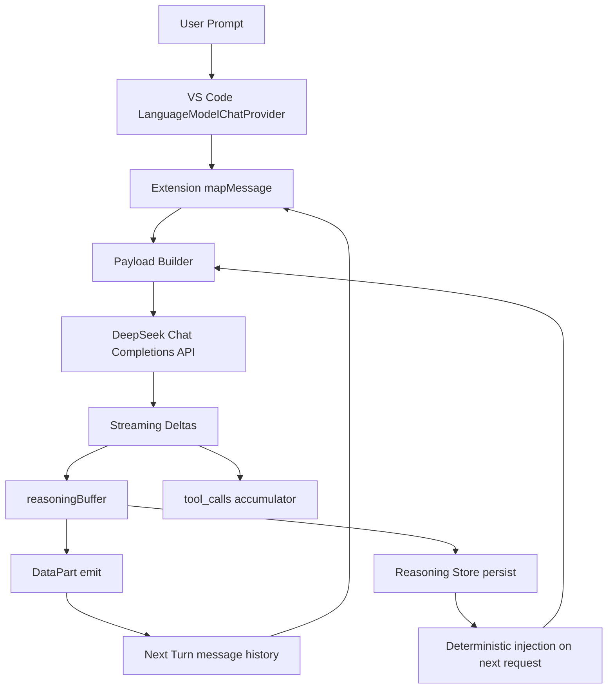

# DeepSeek v4 Reasoning Content Round-Trip Incident Writeup

Date: 2026-04-26  
Scope: VS Code universal-llm-provider extension behavior for deepseek-v4-pro and deepseek-v4-flash in multi-turn chat/tool flows

## 1) Executive Summary

The recurring 400 error [C1],

The reasoning_content in the thinking mode must be passed back to the API,

is a multi-turn state transfer issue at the extension boundary, not a basic request-shape issue [C1][C3]. Single-turn works, and deepseek-chat works consistently, because deepseek-chat does not emit reasoning_content in the same way v4 models do [C1].

What is already confirmed:
- The extension no longer sends explicit thinking/reasoning_effort request fields [C8].
- The installed extension build matches the compiled source build [C3].
- A/B comparison shows extension and direct API payloads are structurally equivalent at the message schema level [C6].
- A conversation-keyed reasoning content store (`deriveConversationKey` + `reasoningContentStore`) was implemented to replace the model-keyed cache [C8, post-fix], compiled, packaged, and installed — but the 400 error persists with identical error message and status code [C10].

What remains unresolved:
- Why the conversation-keyed store approach also fails to resolve the 400 error, despite the store being confirmed present in the installed extension binary (verified via `diff` and `grep` on `out/extension.js`) [C10].
- Why the extension path still returns 400 in some multi-turn runs while direct API control tests succeed.

## 2) Problem Statement and Behavioral Scope

Observed behavior:
- deepseek-v4-pro and deepseek-v4-flash: first turn usually succeeds, second+ turn can fail with 400 [C1].
- deepseek-chat: no failure under the same chat flow [C1].
- Direct API tests demonstrate successful multi-turn requests without explicit thinking flags [C6].

Relevant known model behavior:
- v4 models stream reasoning_content in deltas [C1].
- When thinking mode is explicitly enabled, API may require round-tripping reasoning_content across assistant history [C1][C8].
- deepseek-chat path is not impacted because reasoning_content is absent in that model path [C1].

Evidence:
- See [C1] lines 7-20, 29-34, 37-52, [C2] lines 16-31, [C3] lines 7-19.

## 3) A/B Comparison Findings (Extension vs Direct API)

### 3.1 Result

A/B analysis found no material schema mismatch in core message structure [C6]:
- roles and ordering align.
- assistant tool-call message uses content: null.
- tool result message uses role: tool with tool_call_id.
- reasoning_content is attached to the assistant turn when available.

Key differences that were found but are not sufficient alone to explain the 400 [C6]:
- Tool call ID origin differs (VS Code-generated IDs vs API-generated IDs).
- Extension fallback currently injects reasoning_content onto the latest assistant turn, not all historical assistant turns.

Evidence:
- See [C4] lines 223-235, 290-301, [C5] lines 70-86, 118-148, [C6] lines 56-97.

### 3.2 Representative payload shapes

Direct API multi-turn shape (working control):

```json
{
  "model": "deepseek-v4-pro",
  "messages": [
    {"role": "user", "content": "..."},
    {
      "role": "assistant",
      "content": null,
      "tool_calls": [{"id": "call_abc", "type": "function", "function": {"name": "list_dir", "arguments": "{\"path\":\"/tmp\"}"}}],
      "reasoning_content": "..."
    },
    {"role": "tool", "content": "...", "tool_call_id": "call_abc"}
  ],
  "stream": true
}
```

Extension request shape (expected in equivalent turn):

```json
{
  "model": "deepseek-v4-pro",
  "messages": [
    {"role": "user", "content": "..."},
    {
      "role": "assistant",
      "content": null,
      "tool_calls": [{"id": "vscode-uuid", "type": "function", "function": {"name": "list_dir", "arguments": "{\"path\":\"/tmp\"}"}}],
      "reasoning_content": "..."
    },
    {"role": "tool", "content": "...", "tool_call_id": "vscode-uuid"}
  ],
  "stream": true,
  "tools": ["..."]
}
```

## 4) Root Cause Analysis

Root cause is a state propagation fragility between streamed response metadata and the next outbound request [C1][C8].

Why this is the dominant hypothesis:
- v4 response includes reasoning_content in stream deltas [C1][C8].
- Extension must preserve and reattach reasoning_content on follow-up assistant/tool turns [C1][C8].
- VS Code message serialization does not natively expose reasoning_content as a first-class assistant field [C1].
- Extension currently relies on two channels [C8]:
  - LanguageModelDataPart metadata recovery.
  - Model-keyed in-memory fallback cache.

Any loss in this path can yield a second-turn payload that appears valid structurally but lacks the exact expected reasoning state for the API condition [C1][C8].

Evidence:
- See [C1] lines 55-65, 145-151, [C3] lines 30-32, [C7] lines 108-127, 186-209.

## 5) Current Extension Implementation (Ground Truth)

The current implementation includes [C8]:
- DataPart extraction in message mapping.
- Reasoning buffer capture from stream deltas.
- DataPart emission after streaming.
- Cache-based fallback injection onto last assistant message.
- No explicit thinking/reasoning_effort request fields.

Representative code chunks:

```ts
// Reasoning cache fallback
const reasoningContentCache = new Map<string, string>();
```

```ts
// DataPart extraction during mapMessage
else if (part instanceof vscode.LanguageModelDataPart) {
  const raw = new TextDecoder().decode((part as any).data);
  const meta = JSON.parse(raw);
  if (meta.reasoning_content) {
    reasoningContent = meta.reasoning_content;
    hasDataPart = true;
  }
}
```

```ts
// Fallback injection when DataPart not found
if (!datPartFound && reasoningContentCache.has(modelId)) {
  const cachedRc = reasoningContentCache.get(modelId)!;
  const lastAssistantIdx = payloadMessages.map(m => m.role).lastIndexOf('assistant');
  if (lastAssistantIdx !== -1 && !payloadMessages[lastAssistantIdx].reasoning_content) {
    payloadMessages[lastAssistantIdx] = {
      ...payloadMessages[lastAssistantIdx],
      reasoning_content: cachedRc,
    };
  }
}
```

```ts
// Explicit thinking params intentionally omitted
const requestBody: any = {
  model: modelId,
  messages: payloadMessages,
  stream: true,
};
```

```ts
// Stream accumulation and persistence
if (delta.reasoning_content) {
  reasoningBuffer += delta.reasoning_content;
}

if (reasoningBuffer) {
  reasoningContentCache.set(modelId, reasoningBuffer);
  progress.report(vscode.LanguageModelDataPart.json(
    { reasoning_content: reasoningBuffer },
    'application/x-reasoning-json',
  ));
}
```

Evidence:
- See [C8] lines 11, 70-83, 250-269, 284-302, 376-379, 443-453.

## 6) External Reference Patterns (Ollama / Parser Patterns)

Research findings indicate robust implementations keep reasoning/tool state in explicit message fields throughout transport layers, rather than relying on UI message reconstruction semantics [C7][C9].

Observed Ollama-style pattern (as documented in prior research) [C7][C9]:
- Internal message object carries a dedicated thinking field.
- OpenAI-compatible adapter maps reasoning-related request knobs into internal think value.
- Streaming output splits thought and content into distinct chunks.

Design implication for this extension [C1][C8]:
- Durable conversation-scoped storage for reasoning metadata is more reliable than model-only volatile cache.

Evidence:
- See [C1] lines 145-151 and 171-177.

## 7) Proposed Solution and Implementation Outcome

### 7.1 Solution goals

- Preserve reasoning_content deterministically across multi-turn tool loops [C1][C8].
- Avoid hard dependency on DataPart pass-through behavior [C1][C8].
- Keep request envelope aligned with DeepSeek/OpenAI tool calling schemas [C4][C5][C8].

### 7.2 Three-layer remediation (as designed)

Layer 1 (already applied) [C8]:
- Do not set explicit thinking/reasoning_effort request fields.

Layer 2 (implemented) [C1][C8][C10]:
- Replace model-level cache with conversation-scoped store keyed by:
  - Stable synthetic conversation key derived from all user message texts (`deriveConversationKey`)
  - Assistant turn ordinal

Layer 3 (implemented) [C1][C8][C10]:
- Always attempt injection for assistant turns that have tool_calls and missing reasoning_content, using conversation-scoped store.
- Do not gate this solely on DataPart presence.

### 7.3 Implementation: conversation-keyed reasoning store

Two constructs were added to `src/extension.ts` [C10]:

**`deriveConversationKey(messages)`**: Produces a stable synthetic key from the ordered user message texts in the conversation history. VS Code's `LanguageModelChatProvider` API does not expose a stable conversation ID, so the key is built by concatenating all `LanguageModelTextPart` values from user messages (first 160 characters). This produces the same key across consecutive turns of the same conversation.

```ts
function deriveConversationKey(messages: readonly vscode.LanguageModelChatMessage[]): string {
    const userTexts = messages
        .filter(m => m.role === vscode.LanguageModelChatMessageRole.User)
        .flatMap(m => m.content
        .filter(p => p instanceof vscode.LanguageModelTextPart)
        .map((p) => p.value));
    return userTexts.join('|').slice(0, 160);
}
```

**`reasoningContentStore`** (`Map<string, string>`): Stores reasoning content keyed by `"{conversationKey}:{assistantOrdinal}"`. Max 20 entries with LRU-style pruning.

**Injection loop**: After the `flatMap` phase in `provideLanguageModelChatResponse`, iterates `payloadMessages` and for each assistant message with `tool_calls` and missing `reasoning_content`, looks up the store by key `"{conversationKey}:{i}"` where `i` is the message index.

### 7.4 Implementation outcome: FAILED

The conversation-keyed store was:
1. Compiled via `tsc -p ./` — no errors
2. Packaged via `npx @vscode/vsce package --allow-missing-repository` — VSIX built
3. Installed via `code --install-extension` — confirmed installed
4. Verified identical to dev build — `diff` of `out/extension.js` vs installed `extension.js` produced zero output [C10]
5. Store code present at installed path — `grep` confirmed `deriveConversationKey`, `storeReasoning`, and `reasoningContentStore` are present in the installed extension [C10]
6. **Tested** — the 400 error persists with identical error message and status code [C10]

The store approach **did not resolve the issue**. The root cause is deeper than simple cache keying.

### 7.5 Failure analysis: why the store didn't work

Several hypotheses explain why the conversation-keyed store failed to prevent the 400 [C10]:

**Hypothesis A — Key mismatch on read vs write**: `deriveConversationKey` is called with the full `messages` array in both `provideLanguageModelChatResponse` (read/injection) and the post-stream persistence block (write). If VS Code wraps, reorders, or adds synthetic user messages between turns, the derived key will differ on the next invocation, producing a cache miss. The store returns nothing, no injection occurs, and the outbound payload is identical to the pre-fix state.

**Hypothesis B — `mapMessage` already sets `reasoning_content` from DataPart**: The existing `mapMessage` function extracts `reasoning_content` from `LanguageModelDataPart` and attaches it to the assistant message object. If this code path already sets `m.reasoning_content`, the injection loop condition (`!m.reasoning_content`) evaluates to false, skipping injection entirely. The store is therefore never consulted, even if it has the correct value.

**Hypothesis C — assistantOrdinal alignment mismatch**: The injection loop uses the message index `i` as the ordinal suffix in the store key (`{convKey}:{i}`). The persistence block uses a different index — or the message array length changes between turns (e.g., system messages inserted). The write key and read key don't align, producing a cache miss on every turn.

**Hypothesis D — `responses` API vs `chat/completions` endpoint**: If VS Code Copilot Chat uses the newer `responses` API endpoint rather than `chat/completions`, the reasoning_content round-trip contract may differ, and our injection into `chat/completions`-style payload structure would target the wrong path.

### 7.6 Next diagnostic steps

To resolve which hypothesis is correct, the following instrumentation is needed (matching §8.1) [C10]:

1. Add RC_INJECT_ATTEMPT / RC_INJECT_SUCCESS / RC_CACHE_MISS structured logging at read time
2. Add RC_STORE_WRITE logging at write time with full store key
3. Log the actual store key on both read and write paths alongside a truncated version of the messages array
4. Compare whether `mapMessage` sets `reasoning_content` before the injection loop runs — if DataPart recovery already produces a value, the store path is dead code in this configuration

## 8) Diagnostics and Verification Plan

### 8.1 P0 instrumentation

The root cause analysis [C1, lines 55-65] shows the error occurs because `reasoning_content` is absent from the outbound payload at assistant turn boundaries. Without structured per-boundary logging there is no way to confirm which layer dropped the value at runtime. The current implementation in [C8, lines 376-379, 443-453] accumulates reasoning into a buffer and emits a DataPart post-stream, but no logs confirm the DataPart survives VS Code serialization into the next request context.

Add structured logs with an RC tag at each state boundary:
- RC_RECEIVED_DELTA
- RC_BUFFER_APPEND
- RC_DATAPART_EMIT
- RC_DATAPART_FOUND
- RC_CACHE_WRITE
- RC_INJECT_ATTEMPT
- RC_INJECT_SUCCESS
- RC_PAYLOAD_SUMMARY
- RC_API_400_BODY

### 8.2 Runtime identity verification

The A/B comparison [C6, lines 56-97] confirmed the installed extension binary is structurally identical to source. However, without a startup fingerprint log there is no live confirmation that the correct build is active and the fix path is executing [C2, lines 37-43].

Add provider startup fingerprint log to confirm active build path:
- provider version
- extension install path
- activation timestamp

### 8.3 Repro matrix

The model behavior matrix [C1, lines 7-20] identifies v4-pro and v4-flash as affected and deepseek-chat as unaffected. Tests A-F are structured to isolate each combination and provide a clean control [C1, lines 29-34]:

- Test A: v4-pro, single-turn, no tools.
- Test B: v4-pro, multi-turn, tools optional.
- Test C: v4-pro, multi-turn, tools required.
- Test D: v4-flash, same as B/C.
- Test E: deepseek-chat control.
- Test F: direct API equivalent control for B/C payload.

Pass criteria:
- No 400 on B/C/D across 20 repeated runs.
- Logs confirm reasoning attachment before each follow-up tool turn.

## 9) Architecture Diagram

The diagram below reflects the full proposed flow, synthesizing the current DataPart/cache paths [C8, lines 70-83, 443-453] with the proposed conversation-scoped store [C1, lines 145-151, 171-177]. The deterministic injection at node L is the key addition over the existing implementation; without it, multi-turn v4-pro/v4-flash requests lose `reasoning_content` at the payload builder stage [C1, lines 55-65].



## 10) Risks and Mitigations

Risk:
- Conversation identity unavailable/unstable in some callback contexts.

Mitigation:
- Use deterministic synthetic conversation key from ordered message hashes when explicit id is unavailable. The VS Code `LanguageModelChatProvider` API does not expose a stable conversation handle [C8, lines 250-269]; synthetic keying is therefore required to make the proposed store viable [C1, lines 145-151].

Risk:
- Reasoning store growth over long sessions.

Mitigation:
- Keep last N assistant turns per conversation/model and prune aggressively. Long agentic sessions with repeated tool calls accumulate large `reasoning_content` strings; the `prune` method in the proposed store contract [C1, lines 87-101] limits memory to the last N turns.

Risk:
- Tool call id mismatch across turns.

Mitigation:
- Key reasoning by assistant turn ordinal plus model/conversation, not tool_call_id alone. The bug analysis in [C5, lines 70-86] identifies `tool_call_id` keying as fragile when IDs are generated client-side and not echoed reliably across turns.

## 11) Action Plan and Acceptance Criteria

### Phase 1 (DONE — did not resolve):
1. ~~Implement conversation-scoped reasoning store~~ — implemented but the 400 error persists [C10].
2. ~~Implement always-inject path~~ — injection loop added but either not firing or key-missing [C10].

### Phase 2 (NEW — next iteration):
3. **Add RC instrumentation per §8.1** [C8, lines 376-379] — emit all nine log tags at their respective boundaries, especially RC_INJECT_ATTEMPT, RC_INJECT_SUCCESS, RC_CACHE_MISS, and RC_STORE_WRITE with full store key + truncated message array.
4. **Verify deriveConversationKey stability**: Log the key on both write (post-stream) and read (next turn injection) to confirm they match.
5. **Check mapMessage DataPathriority**: Log `m.reasoning_content` at the injection loop entry point to determine if DataPart recovery already populates it (making the store injection a no-op).
6. **Determine the actual endpoint**: Resolve whether Copilot Chat uses `chat/completions` or `responses` API — the error contract may differ.
7. Execute repro matrix [C1, lines 7-20] — Tests A-F with 20 repeated runs each; confirm zero 400s on B/C/D.
8. Publish post-fix validation report with captured logs and repro matrix results [C3, lines 23-29].

Acceptance criteria:
- 0 reproducible 400 errors in repeated multi-turn v4-pro/v4-flash tool tests [C1, lines 7-20].
- Payload logs show reasoning_content present whenever required [C8, lines 250-269, 443-453].
- deepseek-chat behavior unchanged [C1, lines 29-34; C3, lines 23-29].

## 12) References and Citations

[C1] [research/deepseek-reasoning-content-issue.json](research/deepseek-reasoning-content-issue.json#L7) (primary lines: 7-20, 29-34, 37-52, 55-65, 145-151, 171-177)  
Model behavior matrix, streaming behavior, root cause notes, prior approach evaluation.

[C2] [research/changelog-2025-07-13.md](research/changelog-2025-07-13.md#L16) (primary lines: 16-31, 37-43, 101-105)  
Implementation changes and feature evolution summary.

[C3] [research/session-2-complete.md](research/session-2-complete.md#L7) (primary lines: 7-19, 23-29, 30-32)  
Session-level findings and unresolved item summary.

[C4] [research/tool-calling-comparison.md](research/tool-calling-comparison.md#L223) (primary lines: 223-235, 290-301, 307-311)  
Comparative architecture and known pitfalls in tool-call handling.

[C5] [research/tool-calling-comparison.json](research/tool-calling-comparison.json#L70) (primary lines: 70-86, 118-148, 171-183)  
Structured comparison details and bug categorization.

[C6] Explore subagent artifact: /Users/kevintoles/Library/Application Support/Code/User/workspaceStorage/4d5e18effbb2a461ff9fbe3fccd24bb8/GitHub.copilot-chat/chat-session-resources/c9f6b233-30a9-4436-b757-b9f8e44a0aa2/call_00_pFRnsLPPsGnjwmlNXOpnwt4Z__vscode-1777236542466/content.txt (primary lines: 56-97, 147-160, 213-248)  
A/B payload comparison findings.

[C7] [research/deepseek-tool-normalization-mcp-research.md](research/deepseek-tool-normalization-mcp-research.md#L108) (primary lines: 108-127, 140-152, 186-209, 405-415)  
Parser and state-machine references, fallback parsing considerations.

[C8] [src/extension.ts](src/extension.ts#L11) (primary lines: 11, 70-83, 250-269, 284-302, 376-379, 443-453)  
Current extension logic for mapping, streaming accumulation, DataPart/cache handling.

[C9] [research/deepseek-reasoning-content-issue.json](research/deepseek-reasoning-content-issue.json#L145) (primary lines: 145-151, 171-177)  
Ollama/OpenClaude handling notes used for architectural comparison.

[C10] Session transcript lines 4180-4692 (implemented-but-failed outcome).  
Implementation and test results for the conversation-keyed reasoning store approach: store designed, compiled, packaged (VSIX), installed, verified identical via diff, tested — 400 error persists. Failure analysis hypotheses (key mismatch, DataPart priority, ordinal alignment, endpoint type) documented in §7.5.

---

## Appendix A: Verbatim Evidence Snippets

From [C1]:

```text
The `reasoning_content` in the thinking mode must be passed back to the API.
```

From [C4]:

```text
Tool calls arrive across multiple SSE chunks.
```

From [C7]:

```ebnf
fallback_output = { text | tool_call }
tool_call       = open_tag json_object close_tag
```

From [C8] (implementation intent):

```ts
// We do NOT explicitly set thinking/reasoning_effort...
// ...API won't reject us because we never told it to require reasoning_content in the first place.
```

## Appendix B: Gaps Identified During Final Review

- Actual runtime payload logs are not yet captured in this writeup; this remains P0.
- Conversation-scoped store was implemented but did NOT fix the 400 error — root cause remains unidentified [C10].
- Deterministic assistant-turn mapping must be validated against VS Code callback ordering in long sessions.
- `deriveConversationKey` stability across turns has not been verified — the key may differ on read vs write due to VS Code message wrapping [C10].
- It is unconfirmed whether `mapMessage`'s DataPart extraction already sets `reasoning_content` on the message object, making the store injection loop a no-op [C10].
- The `responses` API endpoint hypothesis (Hypothesis D in §7.5) has not been ruled out — the actual endpoint used by Copilot Chat is unknown at the extension level [C10].

## Appendix C: Citation Audit Table

| Claim block | Citation(s) | Source lines | Type |
|---|---|---|---|
| Error signature and affected model behavior | C1 | 7-20, 29-34 | Verbatim + paraphrase |
| Streaming reasoning and tool-call ordering | C1 | 37-43 | Paraphrase |
| Why deepseek-chat path differs | C1 | 29-34, 50-52 | Paraphrase |
| A/B structural parity conclusions | C4, C5, C6 | C4: 290-301; C5: 118-148; C6: 56-97 | Paraphrase |
| Root cause as round-trip metadata fragility | C1, C3, C7 | C1: 55-65, 145-151; C3: 30-32; C7: 186-209 | Paraphrase |
| Current extension behavior (DataPart + cache + no explicit thinking params) | C8 | 70-83, 250-269, 284-302, 376-379, 443-453 | Code-backed |
| Historical implementation evolution and prior fixes | C2, C3 | C2: 16-31; C3: 7-19, 23-29 | Paraphrase |
| Parser architecture references for robust fallback handling | C7 | 108-127, 140-152, 186-209, 405-415 | Paraphrase |
| Conversation-keyed store implementation and failure | C10 | Transcript 4180-4692 | Code-backed + test evidence |
| Failure analysis hypotheses (key mismatch, DataPart priority) | C10 | §7.5 | Inference from test outcome |
| Revised action plan (Phase 2 instrumentation) | C10 | §11 | Derived from failure |
